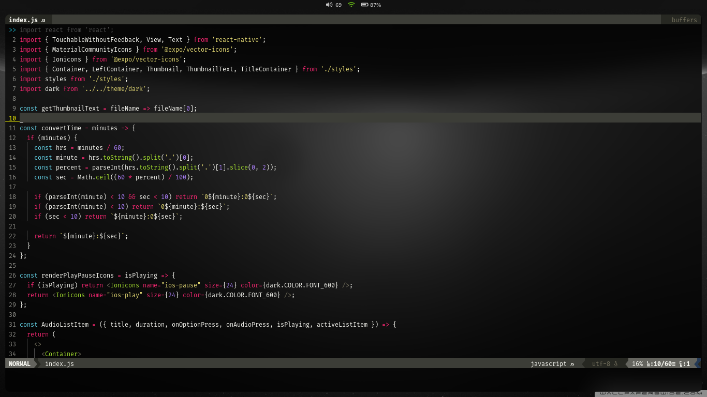

<div id="top"></div>

<!-- PROJECT LOGO -->
<br />
<div align="center">
  <h3 align="center">i3-wm</h3>

  <p align="center">
    My i3wm settings!
    <br />
    <a href="https://github.com/midnightxd/dotfiles"><strong>Explore the docs</strong></a>
    <br />
    <br />
    <a href="https://github.com/midnightxd/dotfiles/issues">Report Bug</a>
    ·
    <a href="https://github.com/midnightxd/dotfiles/issues">Request Feature</a>
  </p>
</div>


<!-- TABLE OF CONTENTS -->
<details>
  <summary>Table of Contents</summary>
  <ol>
    <li>
      <a href="#about-the-project">About The Project</a>
    </li>
    <li>
      <a href="#getting-started">Getting Started</a>
    </li>
  </ol>
</details>


<!-- ABOUT THE PROJECT -->
## About The Project




<p align="right">(<a href="#top">back to top</a>)</p>

<!-- GETTING STARTED -->
<div id="getting-started">
## Getting Started

This is an example of how you may give instructions on setting up your project locally.
To get a local copy up and running follow these simple example steps.

### Prerequisites for window manager
Attention i3 requires an X server and is not supported by Wayland!

```
i3wm Polybar Picom(jonaburg) Vim
```
### Installing i3 on debian based systems
For a complete reference go to: <a href="https://i3wm.org/docs/userguide.html" > i3 docs</a>

Update your system
```sh
sudo apt update && sudo apt upgrade
```
Getting the i3
```sh
sudo apt install i3
```
After the first login, each user will be asked to generate their own configuration file, such as ~/.i3/config or ~/.config/i3/config if this file does not already exist. The prompt allows the user to select the Alt key or the Windows key (also called the Meta key, Start key) as the $Mod modifier key for the i3.

This key is the basis for all the keybinds that the window manager will use. The Windows key is recommended as the Alt key is used by many applications and purposes. i3 will take precedence over other applications, and functionality based on key bindings will be lost if used by i3.<br><br>

Once this is done, copy the config file that is inside setup/i3 (from the cloned repository), to your ~/.config/i3<br><br>

Note that the system still doesn't have the status bar, for this we will now install the polybar, but if you prefer you can use i3's own status bar. Feel free to make your own modifications.

### Polybar installation on debian based systems

Update your system
```sh
sudo apt install polybar
```
For a complete installation and customization reference go to: <a href="https://github.com/polybar/polybar">Polybar</a>

### Installing and customizing vim
Overview:<br>
Vim 8 added a native way to load third-party packages. This means, for me at least, there is no longer any need to use a third party
plugin helper like Pathogen.<br><br>
The approach is very similar to the Pathogen package it adds paths to the Vim runtime path where packages can be added. This is sensible as there are
very few changes required to switch from Pathogen to using the native functionality.

How it works
If you store your vim configuration in ~/.vim a new folder needs to be created within this folder to hold plugins. This is somewhat
confusingly ~/.vim/pack/packages. The folder packages can be anything. You can keep it at packages, change it to my-plugins or your whatever you like.
I chose to use my internet handle.

```sh
mkdir -p ~/.vim/pack/packages/start
```
And
```sh
mkdir -p ~/.vim/pack/packages/opt
```

Within this folder a further folder `start` the im will pick up any packages added to this folder and automatically load the plugins.
Optionally another folder `opt` may be created to hold packages that are not loaded automatically. Packages added in the opt folder may be loaded using:
```sh
:packadd packagename
```

Installing a module for any example:
```sh
cd ~/.vim/pack/packages/start
```
```sh
start$ git clone Your favorite plugins
```

The plugins I use:
* <a href="https://github.com/preservim/nerdtree">NerdTree</a>
* <a href="https://github.com/Yggdroot/indentLine">Indent Line</a>
* <a href="https://github.com/vim-airline/vim-airline">Vim AirLine</a>
* <a href="https://github.com/mhinz/vim-startify">Vim startfy</a>
* <a href="https://github.com/tribela/vim-transparent">Vim transparent</a>
* <a href="https://github.com/ryanoasis/vim-devicons">Vim Icons</a>
* <a href="https://github.com/jiangmiao/auto-pairs">Vim auto-pairs</a>
* <a href="https://github.com/kien/ctrlp.vim">Control P</a>


### Installing the shell I use
Overview CSH/TCSH:<br>
It is essentially the C shell with programmable command-line completion, command-line editing, and a few other features. Unlike the other common shells,
functions cannot be defined in a tcsh script and the user must use aliases instead (as in csh). It is the native root shell for BSD-based systems such as 
FreeBSD.

Getting the tcsh on Debian/Ubuntu/Mint Linux
```sh
sudo apt-get install csh
```

<p align="right">(<a href="#top">back to top</a>)</p>